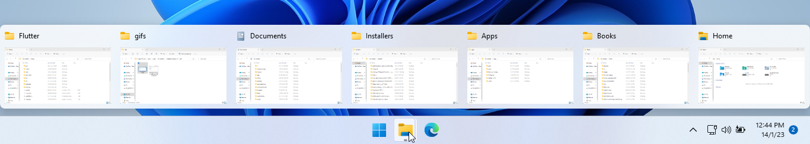
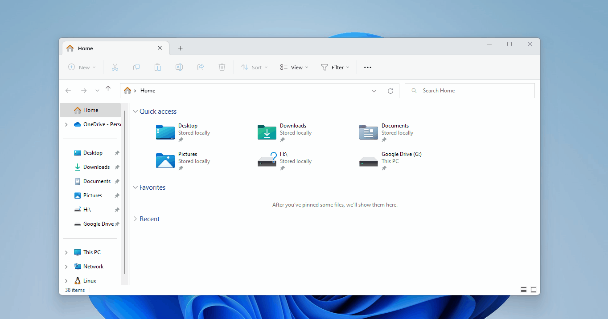
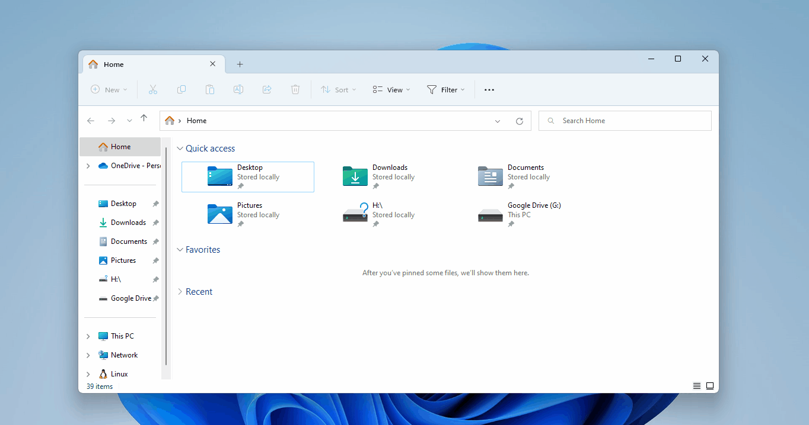
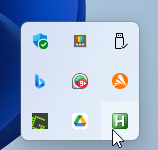

# WinENFET

Never a good sight:



Get rid of File Explorer clutter in Windows 11, use this simple utility to quickly open a new tab instead of a new window in File Explorer, when you press `Win + E`.

`Win + E` before:



`Win + E` after:



If no File Explorer window is open, it will create a new one in the normal way.

**Note**: The Tabs feature for File Explorer is only available in Windows 11 22H2 Stable Build (22621) or later.

## How to use

1. Download WinENFET from the [Releases](../../releases) page.
2. Run the application. \
   Its (white H in a green background) icon will show up in the system tray to indicate that it's running.
    \
   From then on, `Win + E` will open a new File Explorer tab.

### Run WinENFET on startup

You'll likely want to configure the app to run anytime you log in. If you don't know to do this, please follow the steps in Method 2 of [this tutorial](https://allthings.how/how-to-run-an-app-automatically-at-startup-in-windows-11/).

### Run WinENFET as priviledged Scheduled Task at User logon

You can run following commands inside a priviledged Powershell window. The Scheduled Task will start WinENFET at logon of the current User with admin priviledges, but without the annoying UAC promt

```powershell
$Path = 'C:\path\to\WinENFET-v1.0.0.exe'

$actions = (New-ScheduledTaskAction -Execute $Path)
$trigger = New-ScheduledTaskTrigger -AtLogon -User ($env:USERDOMAIN + "\" + $env:USERNAME)
$principal = New-ScheduledTaskPrincipal -UserId ($env:USERDOMAIN + "\" + $env:USERNAME) -RunLevel Highest
$settings = New-ScheduledTaskSettingsSet
$task = New-ScheduledTask -Action $actions -Principal $principal -Trigger $trigger -Settings $settings
Register-ScheduledTask 'Run WinENFET AutoHotkey' -InputObject $task
```


## Limitations

It doesn't work when you press `Win + E` on a virtual desktop when another virtual desktop has an open File Explorer window.

## Help bring this feature to Windows

Please visit the Feedback Hub page at the link below to upvote a suggestion for a built-in option to always open File Explorer in a new tab. More upvotes make it more likely for the Windows team to act positively on the feedback and add the feature in the future.

Link:

```txt
feedback-hub:?contextid=395&feedbackid=68798915-6714-493d-8420-d641f01df988&form=1&src=1
```

Copy and paste it into your browser. It will take you straight to the suggestion page in [Feedback Hub](https://apps.microsoft.com/store/detail/feedback-hub/9NBLGGH4R32N) if you have the app installed.
